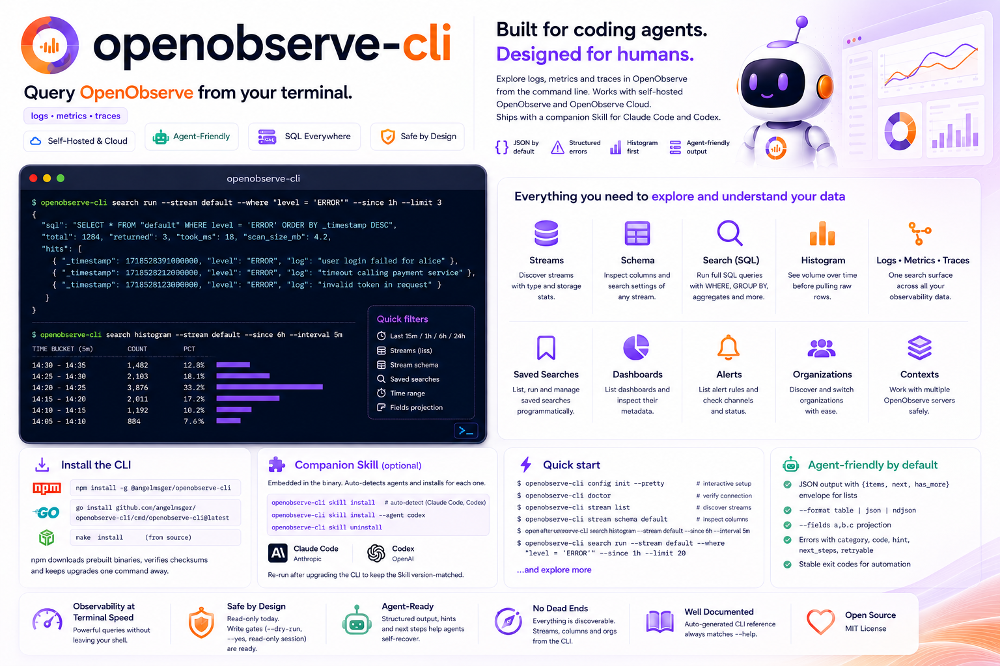

# openobserve-cli

[](https://www.npmjs.com/package/@angelmsger/openobserve-cli)
[](go.mod)
[](LICENSE)
[](https://AngelMsger.github.io/openobserve-cli/)
[](https://openobserve.ai)

> Query OpenObserve from your terminal — built for coding agents.

`openobserve-cli` lets coding agents (Claude Code and others) — and humans —
explore an [OpenObserve](https://openobserve.ai) (O2) backend from the command
line: discover streams, inspect their schema, and run SQL searches and
time-bucketed histograms over logs, metrics and traces. It works with both
**self-hosted** OpenObserve and **OpenObserve Cloud**, returns agent-friendly
JSON with structured errors, and ships a companion Skill that teaches an agent
how to use it.

📖 **Documentation site:** <https://AngelMsger.github.io/openobserve-cli/>



```console
$ openobserve-cli search run --stream default --where "level = 'ERROR'" --since 1h --limit 3
{
  "sql": "SELECT * FROM \"default\" WHERE level = 'ERROR' ORDER BY _timestamp DESC",
  "total": 1284, "returned": 3, "took_ms": 18, "scan_size_mb": 4.2,
  "hits": [ { "_timestamp": 1718528391000000, "level": "ERROR", "log": "…" } ]
}
```

## Features

- **Logs, metrics & traces** — one `search` surface over every stream type, with
  full SQL (`WHERE`, `GROUP BY`, aggregates) via OpenObserve's query engine.
- **Map before terrain** — `search histogram` shows volume per time bucket so an
  agent sees the *shape* of the data before pulling raw rows with `search run`.
- **The CLI owns the footguns** — human time ranges (`--since 1h`, `--from`/`--to`,
  RFC3339, epochs, `now-30m`) are converted to the microsecond timestamps the API
  needs; stream and column names come from discovery commands, never guesses.
- **Agent-friendly output** — JSON by default, a `{items, next, has_more}` list
  envelope, `--format json|table|ndjson`, and `--fields` projection to spend
  minimal context.
- **Errors as navigation** — every failure is structured
  (`category`/`code`/`hint`/`next_steps`/`retryable`) and mapped to a stable exit
  code, so a script or agent can branch and self-recover.
- **No dead ends** — any identifier a command needs is discoverable from another:
  a stream from `stream list`, a column from `stream schema`, an org from
  `org list`.
- **Flexible configuration** — CLI flags, environment variables, a `.env` file, a
  YAML config file, or an interactive wizard; multiple named server *contexts*;
  secrets stored in the OS keychain.
- **Companion Skill** — an `openobserve` Skill, embedded in the binary, that
  guides coding agents (Claude Code, Codex) through the CLI.

> **Scope (v0.1):** read-only — organizations, streams (discovery + schema) and
> SQL search / histogram. Dashboards, alerts, functions/pipelines, users and
> ingestion are planned; the write-safety gates (`--dry-run`, `--yes`,
> session read-only) are already wired for them.

## Installation

### 1. Install the CLI — npm (recommended)

```bash
npm install -g @angelmsger/openobserve-cli
```

npm downloads the prebuilt binary for your platform, verifies its SHA-256
checksum, and keeps upgrades one `npm update -g @angelmsger/openobserve-cli`
away.

<details>
<summary><strong>Other install methods</strong> — go install, source build, prebuilt binary</summary>

```bash
go install github.com/angelmsger/openobserve-cli/cmd/openobserve-cli@latest   # go 1.24+
make install                                                                  # from a source checkout
```

Or download a prebuilt binary from the
[Releases page](https://github.com/AngelMsger/openobserve-cli/releases).

</details>

### 2. Deploy the companion Skill

The `openobserve` Skill is embedded in the binary; it teaches your coding agent
(**Claude Code**, **Codex**) how to drive the CLI. `skill install` probes for
installed agents and installs into each one found:

```bash
openobserve-cli skill install            # auto-detect; install for each agent found
openobserve-cli skill install --agent codex
openobserve-cli skill uninstall          # remove it again
```

Re-run it after upgrading the CLI to keep the Skill version-matched.

### 3. Enable shell completion (optional)

```bash
source <(openobserve-cli completion bash)                         # bash, current shell
openobserve-cli completion zsh > "${fpath[1]}/_openobserve-cli"    # zsh, persistent
```

fish and PowerShell are supported too — see `openobserve-cli completion --help`.

## Quick start

```bash
openobserve-cli config init --pretty  # interactive TUI setup (recommended for humans)
openobserve-cli doctor                # verify configuration and connectivity

openobserve-cli org list              # discover organizations
openobserve-cli stream list           # discover streams (the map)
openobserve-cli stream schema default # queryable columns + search settings

# volume over time, then the rows behind a spike
openobserve-cli search histogram --stream default --since 6h --interval 5m
openobserve-cli search run --stream default --where "level = 'ERROR'" --since 1h --limit 20
```

## Configuration

Settings resolve in precedence order (highest first): CLI flags → environment
variables (`OPENOBSERVE_*`) → `.env` → `~/.angelmsger/openobserve/config.yaml` →
defaults. Secrets are stored in the OS keychain (with a `0600` file fallback) and
never written to the config file.

For headless / CI / agent use, configure entirely from the environment:

```bash
export OPENOBSERVE_URL=http://localhost:5080      # or https://api.openobserve.ai
export OPENOBSERVE_ORG=default
export OPENOBSERVE_EMAIL=root@example.com
export OPENOBSERVE_PASSWORD='Complexpass#123'
# …or a pre-generated token instead of email+password:
export OPENOBSERVE_TOKEN='<base64-or-Basic/Bearer value>'
```

### SSO / OAuth (dex, Authentik, Okta…)

When OpenObserve logs users in through an external identity provider, those users
have no local password and cannot authenticate the CLI directly. Create a
**Service Account** (IAM → Service Accounts), assign it a role, then use its
email + token as the credentials above (the token goes in the password
position). See the **SSO / OAuth** section of
[the getting-started reference](skills/openobserve/references/getting-started.md)
for the full walkthrough.

## Commands

| Command | Purpose |
|---------|---------|
| `org list` / `org use` | discover organizations; set the default one |
| `stream list` | list streams with type and storage stats (the discovery map) |
| `stream schema` | a stream's queryable columns and full-text-search settings |
| `stream get` / `stream stats` | full stream detail; document count, time range, size |
| `search run` | run a SQL query (auto-built from `--stream`/`--where`, or a full `--sql`) |
| `search histogram` | time-bucketed counts — volume over time before pulling rows |
| `auth login` / `status` / `logout` | store credentials, check identity, sign out |
| `config init` / `show` / `contexts` / `use-context` | setup, inspect, manage servers |
| `doctor` | check configuration, credentials and connectivity |
| `skill install` / `uninstall` | deploy or remove the embedded companion Skill |
| `version` | print version and build information |

In the default JSON output, list commands return a `{items, next, has_more}`
envelope; `--format ndjson` instead streams the items themselves, one JSON object
per line (ideal for piping `search run` hits into `jq`). `--fields a,b.c` projects
output down to specific dot-paths.

Time ranges accept `--since 15m|1h|24h|7d`, or `--from`/`--to` as RFC3339, a date,
an epoch (seconds/millis/micros), or `now-30m`; the CLI converts to the
microsecond timestamps the search API requires.

### Multiple servers (contexts)

A single config file can hold several OpenObserve servers as named *contexts*.
Most users need only one and never see the concept. To work with more than one,
run `config init --context prod`, then:

```bash
openobserve-cli config contexts                 # list contexts, current marked
openobserve-cli config use-context prod         # switch the current context
openobserve-cli --use-context prod stream list  # override for one command
```

`OPENOBSERVE_CONTEXT` overrides the current context via the environment.

## Errors and exit codes

Failures are JSON on **stderr** (stdout stays a clean data channel) and map to
stable exit codes: `0` success, `2` usage, `3` config, `4` auth, `5` permission,
`6` not found, `7` rate limit, `8` network, `9` server, `10` parse, `11` conflict.
Each error carries `next_steps` naming the command to run next, and `retryable`
to guide back-off.

## Development

```bash
make build      # compile to ./bin/openobserve-cli
make test       # unit + httptest integration tests
make e2e        # build + run against an in-repo mock OpenObserve server
make lint       # gofmt + go vet
make docs       # regenerate the CLI reference under docs/cli/
```

`AGENTS.md` orients contributors (and coding agents) to the package layout. The
`docs/cli/` reference is generated from the cobra command tree by `cmd/gen-docs`,
so it always matches `--help` — run `make docs` after changing a command or flag.

## Related

From the same author, same agent-first design:
**[confluence-cli](https://github.com/AngelMsger/confluence-cli)** (Confluence as
a knowledge base) and
**[bitbucket-cli](https://github.com/AngelMsger/bitbucket-cli)** (Bitbucket pull
requests and code review).

## License

Released under the [MIT License](LICENSE).
